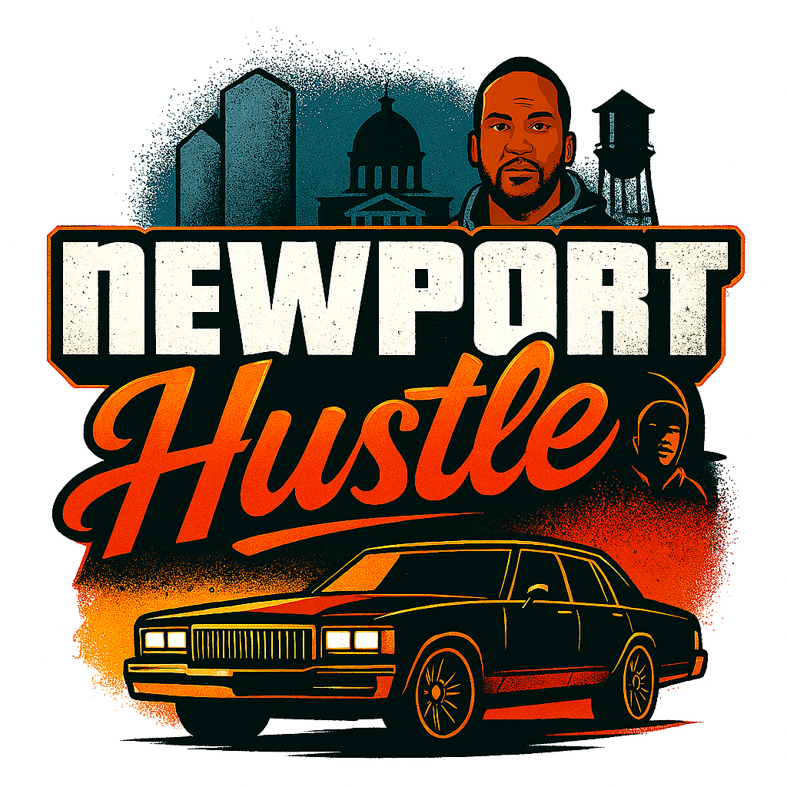

# 🎮 Newport Hustle

## *The Most Ridiculous Small-Town Crime Simulator Ever Made*

### 🤣 What is Newport Hustle?

Ever wondered what Grand Theft Auto would look like if it took place in Newport, Arkansas? Wonder no more! Newport Hustle is the utterly ridiculous mobile game that brings big-city crime drama to small-town charm. It's like GTA, but instead of stealing supercars, you're "borrowing" Box Chevys, and instead of running from SWAT teams, you're being chased by Officer Johnson in his Crown Vic who probably went to high school with your cousin.

### 🏪 **Featuring REAL Newport Businesses!**

- **Jordan's Gas Station** - Where you fuel up and catch up on town gossip
- **Lackey Tamale Shop** - Best tamales this side of the White River (health restoration included!)
- **The Yella Store** - That bright yellow tobacco shop you can see from space

*If you live in Newport and don't laugh at this game, we'll give you your money back!*

---

## 🚗 Vehicle Collection (With Hilarious Knock-Off Names)

Because copyright lawyers are scarier than the Newport PD:

### Classic Rides
- **Riverside Classic** *(Box Chevy Caprice)* - Floats like a boat, turns like a battleship
- **Newport Supreme** *(1984 Cutlass Supreme)* - The car your dad wishes he still had
- **Arkansas Explorer** *(Chevy Tahoe)* - Soccer mom special with room for the whole family

### Luxury Options  
- **Presidential SUV** *(Lincoln Navigator)* - For when you need to feel important in a town of 7,000
- **Luxury Crossover** *(Lexus RX)* - Because even small towns have people with taste

### Performance Cars
- **Arkansas Thunder** - Loud enough to wake up the whole neighborhood
- **Newport Lightning** - Faster than gossip spreading at the Dollar General

### Two-Wheelers
- **Newport Cruiser** *(Harley-style)* - Middle-age crisis on two wheels
- **Street Demon** *(Sport Bike)* - For when you need to outrun your responsibilities

---

## 👥 **Street Characters That Make Newport REAL**

### The Holy Trinity of Small-Town Authenticity:

#### 🕵️ **Snitches** - "Neighborhood Informants"
- Rides: Beat-up BMX bikes
- Superpower: Somehow knowing everyone's business
- Dialogue: *"I seen everything that happened over there"*
- **Warning:** They WILL call the cops on you

#### 🍷 **Winos** - "Neighborhood Philosophers" 
- Rides: Rusty beach cruiser bikes
- Superpower: Deep life wisdom after 2 PM
- Dialogue: *"Life's like riding a bike, sometimes you wobble"*
- **Bonus:** Actually gives good advice (sometimes)

#### 🚲 **Bums** - "Traveling Entrepreneurs"
- Rides: Mountain bikes with baskets full of "treasures"
- Superpower: Knows every shortcut in town
- Dialogue: *"One man's trash is another man's treasure"*
- **Pro Tip:** They'll trade you useful stuff for pocket change

---

## 🚔 **Police System**

The Newport PD operates on a sophisticated 4-star wanted system:

⭐ **Level 1:** Officer Davis pulls you over for a friendly chat  
⭐⭐ **Level 2:** Now you got TWO Crown Vics following you  
⭐⭐⭐ **Level 3:** Sheriff's department joins the party  
⭐⭐⭐⭐ **Level 4:** The whole county's involved (all 6 patrol cars)

*Police Vehicles: "Authority Sedan" (Crown Vic) and "Patrol Classic" (Grand Marquis) - because they bought them at auction and they're LOUD*

---

## 🎯 **Game Features**

### ✅ **What We Got:**
- **Authentic Newport Streets** - Drive down the REAL Main Street
- **Mobile-Optimized Controls** - Touch steering that actually works
- **Community-Driven Characters** - Based on real (consenting) Newport folks
- **Cultural Respect** - We love this town and it shows
- **Small-Town Humor** - Inside jokes only locals will get
- **GTA-Style Gameplay** - But with more politeness and sweet tea

### 🚧 **Coming Soon:**
- Fishing mini-games at the White River
- Annual Tractor Pull tournament mode
- Walmart parking lot social events
- Tornado warning survival challenges

---

## 💼 **Portfolio Project - Source Code Available**

### 🔍 **This is a Development Showcase**
This repository demonstrates Unity game development skills through a complete GTA-style mobile game implementation. All source code is available for review by potential employers or collaborators.

### 🛠️ **Technical Implementation**
- **Engine**: Unity 2021.3 LTS
- **Platform**: Mobile (Android/iOS)
- **Languages**: C# (2000+ lines of game code)
- **Architecture**: Modular system design with JSON configuration

### 📂 **Key Components to Review**
- **[`Scripts/Vehicles/VehicleController.cs`](NewportHustleGame/Scripts/Vehicles/VehicleController.cs)** - Complete vehicle physics system
- **[`Scripts/World/PoliceSystem.cs`](NewportHustleGame/Scripts/World/PoliceSystem.cs)** - AI behavior and wanted system
- **[`Scripts/World/ZoneManager.cs`](NewportHustleGame/Scripts/World/ZoneManager.cs)** - Open-world city management
- **[`Config/VehicleDatabase.json`](NewportHustleGame/Config/VehicleDatabase.json)** - Data-driven game configuration

### � **View the UI/UX System**

Want to see the game interface? Check out the complete UI implementation:

- **[View UI Scripts →](NewportHustleGame/Scripts/UI/)** - All UI components (HUD, Menus, Mobile Controls)
- **[MenuNavigation.cs](NewportHustleGame/Scripts/UI/MenuNavigation.cs)** - Complete menu system with settings
- **[HUDController.cs](NewportHustleGame/Scripts/UI/HUDController.cs)** - Mobile HUD with stats, missions, and location
- **[Joystick.cs](NewportHustleGame/Scripts/UI/Joystick.cs)** - Touch-based mobile controls
- **[BrandingManager.cs](NewportHustleGame/Scripts/UI/BrandingManager.cs)** - App store assets and branding

#### 🌐 Web UI Preview (GitHub Pages Ready)

A static, mobile-style preview of the Newport Hustle UI is available in the repository:

- [WebPreview/index.html](WebPreview/index.html) – splash screen → main menu → mission select → HUD mock, using the real mission titles from Config/MissionData.json.

To host this on GitHub Pages:

1. Push this repository to GitHub.
2. In GitHub, go to **Settings → Pages** for your repo.
3. Under **Source**, select the `main` (or default) branch and the **root** folder, then save.
4. Once the Pages site is built, open: `https://<your-username>.github.io/<your-repo>/WebPreview/` in a mobile browser to explore the UI.

This preview is static (no gameplay), but it matches the mobile menu flow and HUD layout for portfolio and review purposes.

**🎮 Want to Run It Yourself?**

1. **Clone this repository**
2. **Install Unity Hub** and Unity 2021.3 LTS
3. **Open the project** in Unity
4. **Press Play** to see the game in action!

📖 **[Full Setup Instructions →](UNITY_SETUP_GUIDE.md)**

### �🎯 **Development Skills Demonstrated**

- Mobile game architecture and optimization
- Complex physics and AI systems
- JSON-based configuration management
- Professional code organization and documentation
- Complete UI/UX implementation with mobile-first design

---

## 🤝 **Community Involvement**

This game is a **concept project** and **development portfolio piece** created with love and respect for Newport, Arkansas.

### **Current Status:**
- ✅ **Concept Development**: Complete game design and technical implementation
- 🚧 **Community Outreach**: Planning to approach local businesses and community
- 🎯 **Free Game**: Will be offered completely free to the community
- 💼 **Portfolio Project**: Demonstrates game development capabilities

### **How We Plan to Keep It Real:**
- 📧 Will contact all businesses for permission before any release
- 🤝 Character development only with community consent  
- 🆓 **100% Free Game** - no monetization, pure community gift
- ❤️ **Respectful Representation** - celebrating Newport, not mocking it
- 📈 **Developer Portfolio** - showcasing technical and creative skills

### **Want to Get Involved?**
This is a **concept demonstration**. If you're a Newport business owner or community member interested in this becoming real:

Email: **[community@newporthustle.game](mailto:community@newporthustle.game)**  
*Currently seeking community input and permission for actual development*

---

## 🛠️ **Technical Stuff** *(For the Nerds)*

- **Engine:** Unity 2021.3 LTS
- **Platforms:** iOS, Android, Windows, Mac, Linux, Web
- **Language:** C# (over 2000 lines of pure Newport chaos)
- **Graphics:** Mobile-optimized 3D with authentic Arkansas scenery
- **Physics:** Realistic vehicle handling (Box Chevys really DO handle like boats)

---

## 📜 **Legal Disclaimer**

*Newport Hustle is a **concept/portfolio project** and parody game created as a demonstration of game development skills. This is currently a **technical proof-of-concept** and **not an official release**.*

*Any reference to real businesses (Jordan's Gas Station, Lackey Tamale Shop, The Yella Store) is done respectfully as part of a development concept. **No actual permissions have been obtained yet** - this would be required before any public release.*

*The game is designed as a **free community gift** with **no monetization**. The developer's goal is to use this project to demonstrate technical capabilities and potentially build a game development business.*

*If this concept becomes a real game, all business owners and community members would be contacted for permission and consent before any release.*

*The Newport, Arkansas depicted in this concept is enhanced for comedic effect but based on genuine appreciation for small-town community values.*

---

## 📞 **Contact & Support**

### 🎮 **Game Questions:**
- **Discord:** [Newport Hustle Community](https://discord.gg/newport-hustle)
- **Email:** [support@newporthustle.game](mailto:support@newporthustle.game)
- **Website:** [www.newporthustle.game](https://www.newporthustle.game)

### 🏪 **Local Business Inquiries:**
- **Email:** [business@newporthustle.game](mailto:business@newporthustle.game)
- **Phone:** (870) 555-GAME

### 🤝 **Community Relations:**
- **Email:** [community@newporthustle.game](mailto:community@newporthustle.game)
- **Office:** Newport Community Center (when we remember to show up)

---

## ⭐ **Concept Feedback** *(What People Might Say)*

*"I can't believe someone made a video game concept about our town!"*  
**- Potential Newport Resident**

*"If this was real, I'd love to drive to work the same way I do in real life!"*  
**- Future Jordan's Gas Station Customer**

*"My business could sell the best digital tamales in Arkansas!"*  
**- Potential Lackey Tamale Shop Partnership**

*"You could see my store from three blocks away, just like in real life!"*  
**- Potential The Yella Store Feature**

*"This developer really knows how to make small-town life fun!"*  
**- Game Development Portfolio Reviewer**

---

## 🎉 **Special Thanks**

**To the amazing people of Newport, Arkansas** - for inspiring this concept project. We hope to eventually get your blessing to make this real!

**To Jordan's Gas Station, Lackey Tamale Shop, and The Yella Store** - for being such iconic parts of Newport that they inspired this game concept. We'd love to feature you officially someday!

**To small-town communities everywhere** - for proving that the best stories come from real places with real heart.

**To the game development community** - for encouraging creative, community-focused projects that celebrate local culture.

---

### 🚗💨 Ready to Become Newport's Most Wanted?

**[► PLAY THE DEMO NOW ◄](https://demo.newporthustle.game)**

*Warning: May cause excessive laughter, nostalgia for small-town life, and an irresistible urge to visit Newport, Arkansas.*

---

*Made with ❤️, 🤣, and probably too much coffee*  
*© 2025 Newport Hustle Development Team*  
*Proudly made in partnership with Newport, Arkansas*
